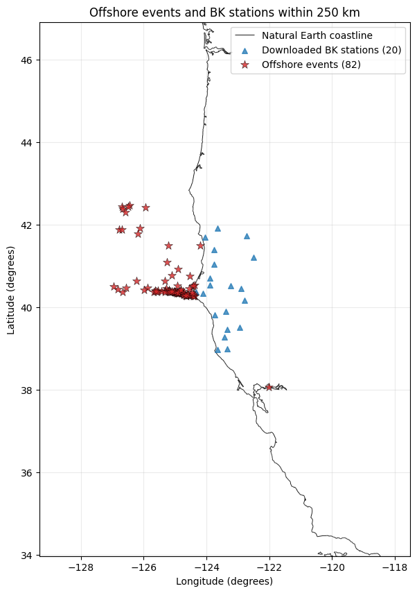
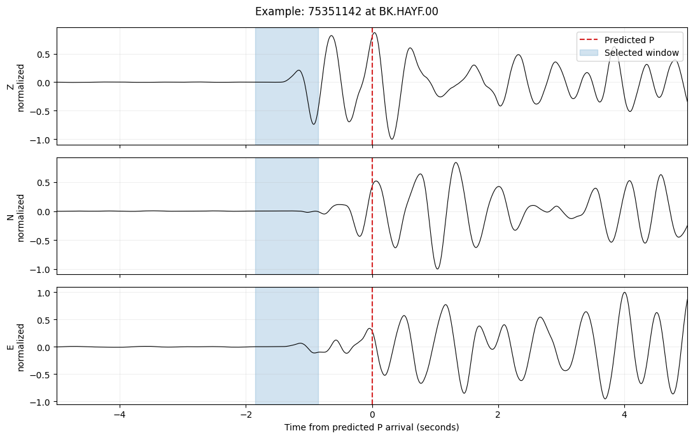
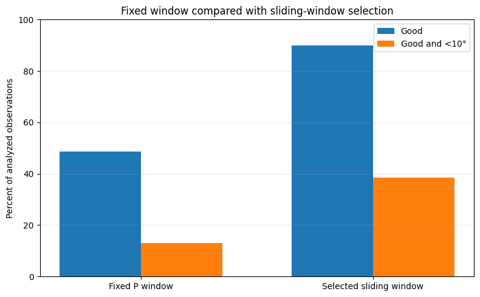
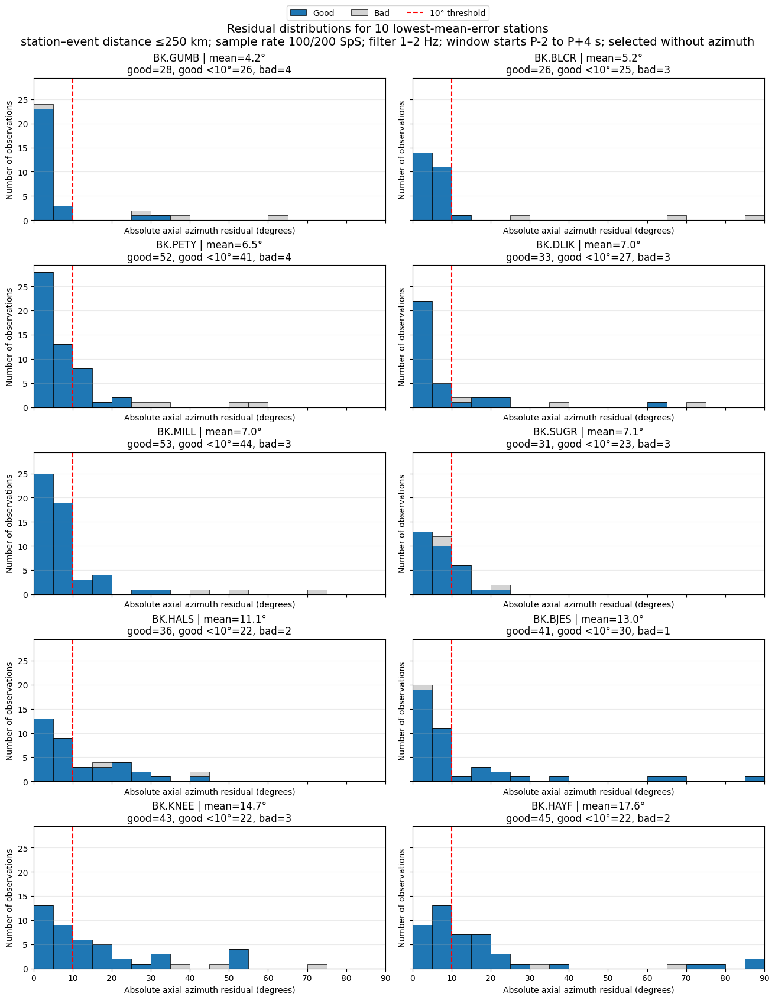

**Andrei Akimov**

*Seismology Skill Building Workshop 2026*

For my final project at the 2026 Seismology Skill Building Workshop, I tested whether the first P wave recorded at a three-component seismic station can point back toward an offshore California earthquake. The main result is that selecting a short window near the predicted P arrival works much better than using one fixed window, although performance still varies strongly among stations.

Offshore earthquakes are a useful test because most recording stations are located on only one side of the event. A polarization estimate could add a directional constraint when only a few stations have reported, but it must be treated as station dependent rather than uniformly reliable.

# Results at a glance

  -----------------------------------------------------------------------------------
  **Measure**                                                 **Result**
  ----------------------------------------------- -----------------------------------
  Analyzed station-event observations                             825

  Good sliding-window observations                            742 (89.9%)

  Good observations with error below 10 degrees     317 (38.4% of all observations)

  Fixed-window Good observations                                 48.6%

  Fixed-window Good and below 10 degrees                         13.1%

  Median selected-window start offset               -1.05 s relative to predicted P
  -----------------------------------------------------------------------------------

This is an exploratory, reproducible research result and has not been peer reviewed.

# Research question and study design

The central question is whether the first P-wave motion recorded at a BK station can point back toward an offshore earthquake. A second question is whether searching several one-second windows near the predicted arrival improves the estimate relative to a fixed P-to-P-plus-one-second window.

  -----------------------------------------------------------------------------------------------------------------------------------------------------------------------
         **Item**         **Choice**                                                        **Reason**
  ----------------------- ----------------------------------------------------------------- -----------------------------------------------------------------------------
           Area           California and nearby offshore region                             Uneven station coverage makes offshore events a practical directional test.

           Time           2020 through the notebook run date                                Provides a useful set of recent events.

          Events          Offshore earthquakes, magnitude 4.0 or larger                     Larger events are more likely to produce a clear P wave.

         Stations         10 previously successful and 10 poor BK stations, within 250 km   Keeps the run manageable while retaining both strong and weak stations.

         Channels         Complete Z, N, and E at 100 or 200 samples per second             Three components are required to estimate particle motion.

          Catalog         NCEDC                                                             Provides origins, magnitudes, and station metadata.

         Waveforms        EarthScope first, then NCEDC                                      Two services improve data availability.
  -----------------------------------------------------------------------------------------------------------------------------------------------------------------------

The station groups were fixed before the current run. The successful group was ranked using earlier observations that were both Good and within 10 degrees of the catalog direction. Each poor station had at least 25 earlier analyzed observations and a low strict-success percentage. This design deliberately tests both favorable and unfavorable stations, but it is not a random sample of the entire BK network.

# Geographic coverage

The retained earthquakes are concentrated offshore of northern California, while nearly all stations are on land to the east. The map makes the one-sided geometry, long paths, and coverage gaps visible; these features should be considered when interpreting the residual statistics.

{alt="Map of offshore California earthquakes and twenty BK seismic stations within 250 kilometers." width="4.349998906386702in" height="6.178155074365704in"}

# Processing and polarization measurement

The notebook requests event origins and magnitudes from NCEDC, retains offshore epicenters, and pairs each event with selected stations within 250 km. It does not use catalog P picks. Instead, it predicts P travel times using the SCSN Hadley-Kanamori one-dimensional model below 152.78 km and ak135 at larger distances, assuming an 8 km source depth.

Each waveform is processed using the following sequence:

- Remove the average value measured before the P wave.

- Remove instrument sensitivity so the three components are comparable.

- Apply a causal 1-2 Hz band-pass filter.

- Measure noise from 15 to 5 seconds before the predicted P time.

- Test one-second windows beginning from P-2 to P+4 seconds in 0.05-second steps.

- Require a window-to-noise RMS ratio of at least 3, rectilinearity of at least 0.5, and incidence of at least 10 degrees.

- Among candidates close to the best rectilinearity, choose the earliest window.

The Flinn method finds the principal axis of three-component particle motion. Because an axis has two equivalent ends, the reported azimuth error ranges from 0 to 90 degrees. The known event direction is used only after window selection to measure the error; it is not used to select the window.

{alt="Three-component filtered waveform with a selected polarization window before the predicted P arrival." width="6.2in" height="3.92837489063867in"}

In this example the selected window begins before the predicted arrival. Across all accepted observations, the median start offset was -1.05 seconds. This does not necessarily mean that the travel-time prediction is wrong by the same amount: filtering, emerging signal energy, source complexity, and the window-selection rule can all contribute.

# Fixed window compared with moving window selection

The fixed-window test uses the interval from P to P+1 second. The moving-window test searches from P-2 to P+4 seconds and selects the earliest candidate near the maximum rectilinearity that passes the quality tests. The moving method improved both waveform acceptance and directional accuracy.

  ----------------------------------------------------------------------------------------
  **Method**                       **Good**           **Good and error below 10 degrees**
  ------------------------ ------------------------- -------------------------------------
  Fixed P window                     48.6%                           13.1%

  Selected moving window             89.9%                           38.4%

  Change                    +41.3 percentage points         +25.3 percentage points
  ----------------------------------------------------------------------------------------

{alt="Bar chart showing higher success percentages for the selected moving window than for the fixed P window." width="6.45in" height="4.0006332020997375in"}

Of 825 analyzed observations, 742 passed the moving-window quality criteria and 317 were also within 10 degrees of the catalog direction. A waveform can therefore look sufficiently strong and linear without producing an accurate back azimuth. Quality acceptance and directional correctness are related but distinct tests.

# Station level results

Performance differed sharply among stations. The table below reproduces the current notebook\'s complete 20-station summary in a compact form. Mean error refers to Good observations only, while the below-10-degree column counts Good observations meeting the strict directional threshold.

  ---------------------------------------------------------------------------------------------------------------------
  **Station**    **Group**   **Analyzed**   **Good**   **Good and \<10 deg**   **Mean error deg**   **Median shift s**
  ------------- ----------- -------------- ---------- ----------------------- -------------------- --------------------
  BK.MILL          Best           56           53               44                    7.02                -2.00

  BK.PETY          Best           56           52               41                    6.54                -1.75

  BK.BJES          Best           42           41               30                   12.98                -0.55

  BK.DLIK          Best           36           33               27                    6.99                -1.55

  BK.GUMB          Best           32           28               26                    4.16                -1.65

  BK.BLCR          Best           29           26               25                    5.16                -2.00

  BK.SUGR          Best           34           31               23                    7.09                -1.52

  BK.HAYF          Best           47           45               22                   17.63                -1.60

  BK.KNEE          Best           46           43               22                   14.67                -0.55

  BK.HALS          Best           38           36               22                   11.14                -1.30

  BK.SANG          Poor           48           45                7                   34.89                +0.00

  BK.BONV          Poor           43           34                5                   28.22                -1.20

  BK.SPAN          Poor           36           27                5                   42.73                +0.93

  BK.ORRS          Poor           35           28                5                   36.02                -0.30

  BK.YBH           Poor           47           43                5                   23.65                -1.30

  BK.RBOW          Poor           66           55                3                   61.17                +0.00

  BK.HULL          Poor           28           25                3                   24.81                -1.27

  BK.RVIT          Poor           43           41                2                   38.56                -1.00

  BK.WLKR          Poor           37           33                0                   47.74                +0.35

  BK.DCMP          Poor           26           23                0                   45.05                -1.65
  ---------------------------------------------------------------------------------------------------------------------

BK.MILL and BK.PETY produced the largest numbers of strict successes, with 44 and 41 Good observations below 10 degrees. BK.GUMB had the smallest mean absolute error among Good observations, 4.16 degrees. At the other extreme, BK.WLKR and BK.DCMP had no strict successes in this run despite 37 and 26 analyzed observations. These contrasts show why a single network-wide percentage cannot describe station performance.

# Residual distributions at the strongest stations

The diagnostic histograms below show the ten well-sampled stations with the lowest mean absolute error among Good observations. A narrow concentration near zero indicates that the measured particle-motion axis frequently points toward the earthquake. A broad tail indicates less reliable directional performance under the same processing settings.

{alt="Ten histograms of absolute axial azimuth residuals for the strongest-performing BK stations." width="5.25in" height="6.771738845144357in"}

The histograms also show that good average performance does not eliminate outliers. Several otherwise strong stations retain isolated residuals far above 10 degrees. A practical locator should therefore combine polarization with arrival times or agreement among neighboring stations rather than trusting one measurement by itself.

# Interpretation

The moving-window result supports a simple operational conclusion: the most informative P-wave interval is often not exactly the fixed interval beginning at the predicted arrival. A short search near P can recover a clearer linear segment, especially when the theoretical arrival is approximate or the first visible energy is emergent. The station dependence is equally important. Local geology, scattering, channel orientation, site conditions, event depth, source radiation, and errors in the predicted P time can rotate or weaken the measured particle motion. Passing signal-to-noise, rectilinearity, and incidence tests does not guarantee a correct direction.

# Limitations

- The travel-time table assumes an 8 km source depth even though catalog depths vary.

- Only one frequency band, 1-2 Hz, and one-second polarization windows were tested.

- The study uses a fixed, deliberately contrasted 20-station subset and may not represent the full BK network or other networks.

- Offshore geometry places most stations on one side of an earthquake.

- Catalog locations are treated as the reference direction but also contain uncertainty.

- Current catalog and station availability can change, so a future notebook run may give slightly different percentages.

# Next tests

- Use source-depth-dependent travel times instead of a single 8 km assumption.

- Compare several frequency bands and window lengths.

- Require agreement among nearby stations before accepting a directional constraint.

- Combine polarization estimates with P-arrival times in an initial offshore location method.

- Evaluate the rules on a separate set of earthquakes not used to select thresholds or station groups.

# Data software and reproducibility

Event and station metadata came from NCEDC. Waveforms were requested from EarthScope first and NCEDC second. Coastlines came from Natural Earth. Polarization was calculated with ObsPy\'s Flinn implementation. The executed notebook retains the figures, tables, station-level results, event-level results, code, and stated limitations.

**Project notebook:** [[View the complete executable notebook]{.underline}](https://nbviewer.org/urls/www.iris.edu/hq/files/short_courses/2020/ssb/akimov_offshore_california_p_wave_polarization.ipynb)
